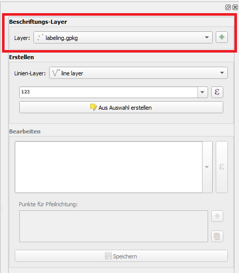

# Manual information

## 1. Open Easy Label Menu

## 2. Select or Create new Labeling Layer

Per default the the current project's crs will be used.
You can not change it later.

## 3. Select Reference Line Layer

1. Select an existing reference layer.
2. Enter an expression for new label points
3. Create new label points from selected line features

## 4. Edit selected Labeling Point

You can edit existing Labeling Expression and change the arrows.
To delete points just delete it from the attribute table with the default options form QGIS.

## Default Style
Of course you can edit the default style with render and label options.